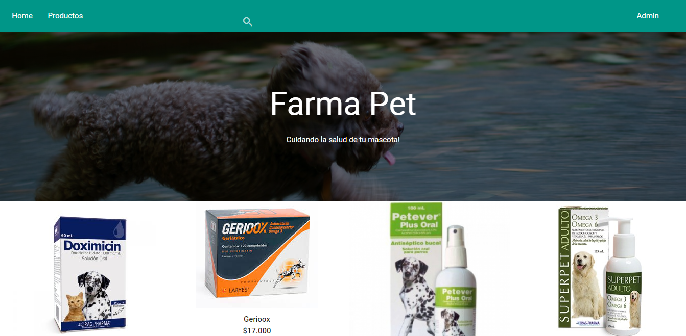

todo el detalle en main

# < Shopping >

## Algunos comandos importantes para Rails y Heroku

### Rails
**Nota:** la consola debe estar en el `./root` del proyecto.
```sh
rake -T # genera un listado de tareas

# entre las más importantes:
rake db:create # crea la base de datos, por lo que debes asegurarte que no exista
rake db:drop # elimina la base de datos, debes asegurarte de no tener usuarios conectados a la misma
rake db:migrate # crea el esquema de base de datos, estos son: tablas, relaciones, claves primarias, etc...
rake db:seed # inyectas data a la base de datos. ./my-app/db/seeds.rb

rails s # corre el servidor, por defecto en localhost:3000, puedes usar el flag -p para asignar otro puerto y el flag -b para asignar una ip
# consulta tu ip con el comando ipconfig (para windows)
# ejemplo: 
# rails s -p 3500 -b 192.168.0.14
# para poder consultar 192.168.0.14:3500/ y ya no sería localhost:3000/
# y esto para qué? para poder conectarse desde diferentes dispositivos que estén en la misma red, laptops, smartphones, tablets, etc... Ahora tu máquina es un servidor más real
rails c # abre una terminal de consulta para tus modelos, por ejemplo, puedes hacer consultas como:
# Admin.all para consultar todos los registros de la tabla admins, la salida es un poco fea, pero tenemos instalada la gema awesome_print que nos ayudara en eso. Solo debemos colocar ap antes de la consulta, ap Admin.all y todo sera más para humanos. Existen otros métodos como find, find_by, find_by_<nombre-columna>, etc...
```
### Heroku
* Debes tener una cuenta y un proyecto creado en la plataforma primero.
* Debes instalar [Heroku CLI](https://devcenter.heroku.com/articles/heroku-cli) y seguir las instrucciones para asociar el usuario.
```sh
heroku login
```
```sh
heroku git:remote -a <nombre-proyecto-heroku> # para vincular al proyecto creado en heroku
# en este punto ya pueden ir a la sección de deploy de su proyecto en heroku y asociar su repositorio github, donde tienen el proyecto rails con los cambios, para que funcione ese despliegue, deben agregar en el archivo Gemfile la gema rails_12factor dentro de un bloque para producción, ejemplo: group :production
# también es importante agregar la versión de ruby dentro del Gemfile para que heroku sepa cual debe instalar, ejemplo ruby '2.4.3'
heroku run rake db:migrate # creara el esquema de base de datos en la base de datos de heroku dentro del proyecto
heroku run rake db:seed # inyectara la data dentro de seeds.rb a la base de datos
```
> Quieres limpiar la base de datos?

```sh
heroku pg:reset DATABASE # puedes agregar el flag --confirm <nombre-app-heroku> para poder confirmar. Debes correr :migrate otra vez y :seed
```
> Quieres monitorear lo que pasa en heroku?
```sh
heroku logs --tail
```
**Notas:** 
* En windows las consolas se quedan congeladas y dan la impresión de que el sistema no funciona, nada que un `ENTER` no pueda resolver.
* Generalmente los `backends` disponemos de varias consolas al mismo tiempo **XD**.

Éxitos!!!
